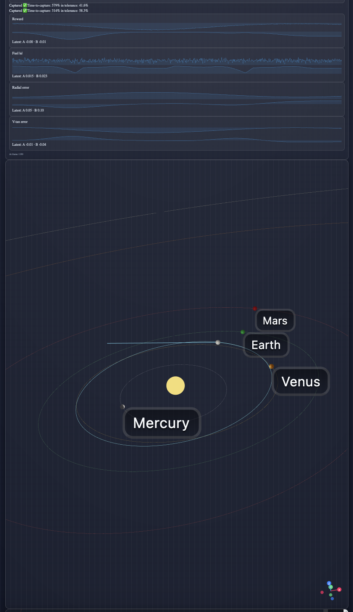

# Orbital RL + Solar System

An interactive **3D web application** built with **React**, **Three.js**, and **Tailwind CSS** that visualizes a spacecraft "agent" flying in a Sun-centered gravitational field alongside planets with Keplerian orbits.  
This project serves both as a **visual demo of reinforcement learning (RL)** applied to orbital mechanics and as a **showcase of explainable AI**, featuring a GPT-powered mission assistant.

 <!-- Add a screenshot later -->

---

## Overview

The **Orbital RL Project** consists of two repositories:

- **orbital-rl (backend)**  
  Generates the spacecraft trajectory data (`rollouts`) using a custom orbital environment and reinforcement learning algorithms such as **PPO**.

- **orbital-frontend (this repo)**  
  Provides a **3D interactive visualization**, analytics, and LLM-based explanations of the spacecraft's behavior.

### Core Features

- **3D visualization** of spacecraft, Sun, and planets using `@react-three/fiber` and `three.js`.
- **A/B comparison** of two rollouts:
  - `Random` agent vs `PPO-trained` agent.
- **Split-screen mode** to view both runs side-by-side.
- **Event timeline** with markers for thrust spikes, orbit capture, and anomalies.
- **Analytics dashboard**:
  - Total reward
  - Fuel usage (∑|u|)
  - Capture timing and percentage of time-in-tolerance
- **LLM-assisted features**:
  - **Mission Modal** – draft new missions with GPT guidance.
  - **Explain Panel** – natural-language explanations of what the spacecraft is doing.
- **TailwindCSS UI** with scientific styling.

---

## Demo

**Controls:**
| Action             | Key |
|--------------------|-----|
| Toggle A/B policy  | `B` |
| Toggle Split View  | `S` |
| Play / Pause       | `Space` |
| Step forward/back  | `←` / `→` |
| Explain last 10s   | `K` |
| Open Mission Modal | `M` |

---

## 🚀 Tech Stack

| Layer     | Tech |
|------------|------|
| **Frontend** | React 19, Vite, TailwindCSS 4, Three.js, @react-three/fiber, @react-three/drei |
| **Backend (RL engine)** | Python, Gymnasium, Stable-Baselines3, NumPy, PyYAML |
| **LLM Service (proxy)** | Node.js, Express, OpenAI GPT API |
| **RL Engine** | Custom Python orbital environment (in `orbital-rl` repo), PPO training via RL library |
| **Data** | JSON rollouts with per-step state and metrics |
| **Charts** | Recharts (sparklines for metrics) |

---

## 📂 Project Structure

```
orbital-frontend/
├── api/                # API route handlers (LLM proxy)
│   └── llm.js
├── public/
│   └── rollouts/       # Rollout JSON files for Random & PPO policies
│       ├── run_01.json
│       ├── run_ppo.json
│       ├── run_random.json
│       └── planets.json
├── server/
│   └── index.js        # Node.js server for /api endpoints
├── src/
│   ├── components/     # Reusable UI components
│   │   ├── Badges.jsx
│   │   ├── ComparePanel.jsx
│   │   ├── ExplainPanel.jsx
│   │   ├── MissionModal.jsx
│   │   ├── Spark.tsx
│   │   ├── Sparklines.jsx
│   │   ├── SplitView.jsx
│   │   └── Timeline.jsx
│   ├── assets/         # Images, icons, etc.
│   ├── App.jsx         # Main React App
│   ├── Scene3D.jsx     # 3D scene logic
│   └── useRollout.js   # Custom hook for loading and processing rollout data
├── index.html
├── tailwind.config.js
├── vite.config.js
└── package.json
```

---

## ⚙️ Installation

### 1. Clone both repositories
```bash
# Backend (for rollout generation)
git clone https://github.com/yourname/orbital-rl.git

# Frontend (this repo)
git clone https://github.com/yourname/orbital-frontend.git
```

### 2. Install dependencies
```bash
cd orbital-frontend
npm install
```

### 3. Configure environment variables
Create a `.env` file in the root:

```
OPENAI_API_KEY=your_openai_api_key_here
```

### 4. Sync rollout files
Ensure your rollout JSONs are copied from the backend to the frontend:
```bash
npm run sync:random
npm run sync:ppo
```

This will copy files into `public/rollouts/`.

### 5. Run the dev server
```bash
npm run dev
```

Frontend will be available at: [http://localhost:5173](http://localhost:5173)

---

## 🌌 Usage

1. Launch the app.
2. **Play** to watch a spacecraft controlled by either a Random or PPO policy.
3. Toggle between policies with the **A/B button** or press **B**.
4. Switch to **Split View** to see both policies simultaneously.
5. Hover over timeline markers to see thrust spikes or capture events.
6. Use the **Explain Panel** to get an AI-generated description of what’s happening.

---

## 🧠 LLM Integration

The LLM features are handled through `/api/llm`:

- `ExplainPanel` sends the current state and mission context to the backend.
- Backend (`api/llm.js`) calls OpenAI GPT API and returns plain text explanations.

Example payload:
```json
{
  "system": "You are an expert orbital mechanics tutor.",
  "prompt": "Explain what the spacecraft is doing.",
  "json": false
}
```

Run the backend server:
```bash
npm run server
```

---

## 🛰 Future Roadmap

- Live PPO training visualization.
- Event-based camera transitions.
- Export GIFs or screenshots for presentations.
- Mission generator with predefined templates.
- Extended analytics and custom plotting.

---

## 🤝 Contributing

Contributions are welcome!
1. Fork the repo
2. Create a feature branch
3. Submit a PR with a clear description.

---

## 📝 License

MIT License © 2025 Martin Enke

---

## 🙌 Acknowledgements

- OpenAI GPT API for natural language explanations.
- @react-three/fiber and drei for the 3D engine.
- TailwindCSS for streamlined UI development.
- Reinforcement learning libraries and physics-based modeling inspiration.
